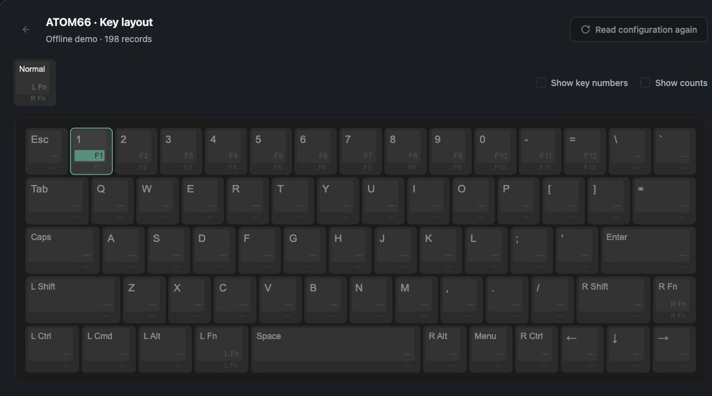

# NIZ Web

**English** · [简体中文](README.zh-CN.md)

Remap keys, set up macros, and back up your NIZ keyboard configuration in a browser. Connect directly over USB, with no configuration software to install. **Currently supports ATOM66 only.**



**[Open NIZ Web](https://cbingb666.github.io/niz-web/)** · [User guide](docs/usage.md) · [Report a bug](https://github.com/cbingb666/niz-web/issues/new?template=bug-report.yml)

> [!WARNING]
> This is an experimental port. USB authorization, reads, writes, and RGB controls have not yet been validated on a real keyboard through the web app.
> Start by reading the configuration and downloading a backup. Check its contents before trying a write. [Validation history (Chinese)](VALIDATION.md)

## Get started

You need an ATOM66, a USB data cable, and desktop Chrome or Edge. Close other keyboard configuration tools first.

1. **Connect your keyboard.** Open the app, click **Connect a device**, and follow the steps to check the model, plug in the cable, and grant access.
2. **Read the configuration.** Back on the Devices page, click **Configure device** on the keyboard's card and confirm the read.
3. **Download a backup.** After reading succeeds, click **Export configuration** to save the original JSON file.
4. **Remap a key.** Click a mapping on a keycap and choose a new action. For shortcuts and macros, click **Apply this edit** when finished.
5. **Write to the keyboard.** Click **Review and write**, check the changes, and confirm. Wait for writing and verification to finish.

**The keyboard is temporarily locked during reads and writes. You cannot type during this time.** Keep the USB cable connected until the operation finishes.

To try the interface without a keyboard, choose **Offline demo** on the **Connect a device** page. Editing and importing change the configuration in the page; the keyboard changes only after you confirm a write.

## Features

- **Keys and macros:** Edit the normal, right Fn, and left Fn layers. Set shortcuts, rapid fire, and macros, with undo and redo.
- **Configuration files:** Import JSON and ATOM66 Windows `.pro` files, export JSON, and manage local browser backups.
- **Devices:** Manage multiple keyboards and read key counts. Set per-key colors on RGB models.
- **Offline editing:** Try the app, import files, and edit without a connected keyboard. The interface supports Simplified Chinese and English.

## Where your configuration is saved

Edits stay in the current page. **Export them before closing it.** Local backups are stored in the current browser. They do not move automatically to another browser or site address, and clearing site data may delete them.

Once loaded, the app does not upload your keyboard configuration or key counts. There is no cloud sync. Keep downloaded JSON files for recovery. See [Backups and recovery](docs/usage.md#backups-and-recovery).

## Current limitations

- No firmware updates, sensor calibration, or global macro recording.
- An interrupted write may leave partial changes. There is no automatic rollback. Read the keyboard again, check its state, and restore a backup from before the write if needed.
- Connecting requires a browser with WebHID support. Other browsers can use offline features only.

For connection, import, or write problems, see [Troubleshooting](docs/usage.md#troubleshooting).

## Run locally

Use Node.js 24 and npm. Run these commands in a terminal:

```sh
git clone https://github.com/cbingb666/niz-web.git
cd niz-web
npm ci
npm run dev
```

Open <http://127.0.0.1:5173>.

Run `npm run build` to create `dist/index.html`, a standalone page for offline editing or static hosting.

USB and backup permissions have not been validated on real hardware when opening the HTML file directly. Use an HTTPS page or the local development server to connect a keyboard.

## Feedback and contributions

Use the [bug report](https://github.com/cbingb666/niz-web/issues/new?template=bug-report.yml) form to report a problem, or the [feature request](https://github.com/cbingb666/niz-web/issues/new?template=feature-request.yml) form to suggest an improvement.

Contributions to code, documentation, and translations are welcome. See the [contributing guide](CONTRIBUTING.md) for setup, checks, and pull requests.

## License

Original source code is licensed under the [MIT License](LICENSE). Third-party components, device images, and vendor software retain their own copyrights and licenses. See the [shadcn/ui license](src/components/ui/LICENSE), [image credits (Chinese)](src/assets/README.md), and [vendor software notes (Chinese)](drivers/README.md).
